## Exp

[Skip boring text..](#showroom)

### 2020

* Reverse engineer and reimplement racing simulator physics (C++, UE4)

### 2019

* Robot platform odometry and SLAM (C++, eLinux, JetsonTK1, OpenNI2, OctoMap, ORB_SLAM2, OpenVSLAM)
* Android sensor reader plugin (C++, UE4, Java, Android)
* Arduino device communication plugin (C, C++, UE4)
* RPLidar A1 plugin for virtual touch screen project (C++, UE4)
* Yost 3-Space sensor plugin (C++, UE4)
* Blackmagic DeckLink capture card plugin (C++, UE4)
* Assetto Corsa SDK (C++)

### 2018

* PowerFC ECU digital dashboard (C++, Qt, eLinux, RaspberryPi)
* Rotary engine compression tool (C, C#, STM32)
* RealSense2 driver for OpenNI2 (C++)
* RealSense2 plugin (C++, UE4)
* GStreamer plugin (C++, UE4)

### 2017

* Game security research (C, C++, IDA, WDM, DKOM, DX11, UE4)
* Multicamera DVR plugin (C++, UE4, Leadtools Multimedia SDK)

### 2016

* Image generator for helicopter pilot training system (C++, UE4, RakNet)
* OpenNI plugin (C++, UE4)
* Mother Russia Bleeds multiplayer mod (C#, Unity)

### 2015

* Augmented reality app for Dota2 (C++, Android, NDK, OpenCV)
* Game movie recording tool (C++, C#, WinAPI, DX11)

### 2014

* Robot platform firmware (C, C++, STM32, JetsonTK1, eLinux, Android, OpenNI, RakNet, GStreamer)
* Quadrotor telemetry system (C, C++, RaspberryPi, eLinux, OpenNI, ArduPilot, MavLink)
* 2D rendering library for RaspberryPi (C++, eLinux, GLES2)

### 2013

* Support Windows kernel display driver (C, C++, WDM, WDDM)
* Find people by interests service (C#, Mono, LAMP)

### 2012

* Bot for Stronghold Kingdoms MMORTS (C#, Mono, ASP.NET)
* Profile and optimize OpenNI SDK (C, C++, eLinux, PandaBoard)
* OpenNI browser plugin (C++, boost, NPAPI, Firebreath)

### 2011

* Surround sound subsystem for flight simulator (C++, C#, FMOD)
* Tune VegaPrime middleware (C++, OpenGL)

### <2010

* Data analysis and report generation module (C++, WinAPI, MFC, ODBC)
* Modbus TCP/RTU module (C++, WinAPI, WinSock, MFC)
* Hidden objects puzzle game (Lua, Playground SDK)
* Control system of industrial process (C, Codesys, Wago, PLC)
* Port corporate web portal (C#, ASP.NET2, MSSQL)
* Position based dynamics simulation (C++, OpenGL)

## Showroom

### Racing simulator physics

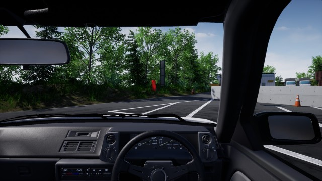

[videoA](https://www.youtube.com/watch?v=ReH5SKfPKS8)

[videoB](https://www.youtube.com/watch?v=_Vdnzy6Gkxc)

### Depth mapping

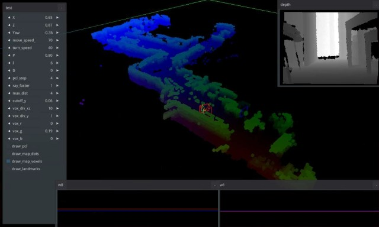

[video](https://www.youtube.com/watch?v=zUFaG2EHwf4)

### PowerFC ECU digital dashboard

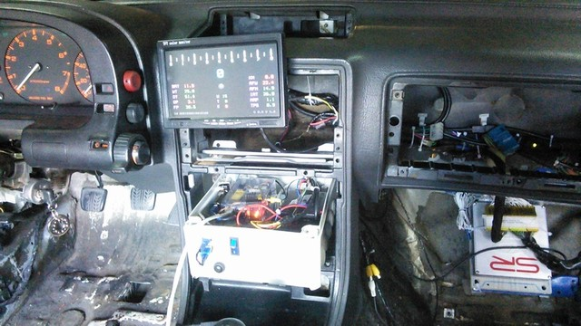

[video](https://www.youtube.com/watch?v=ydlUFpkKHHQ)

### Rotary engine compression tester

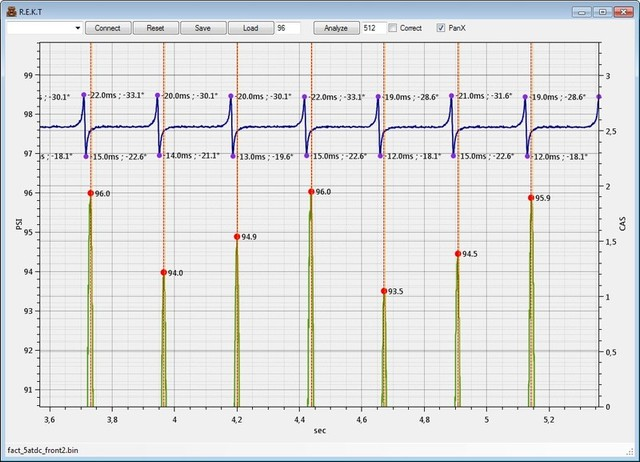

### RealSense2 driver for OpenNI2

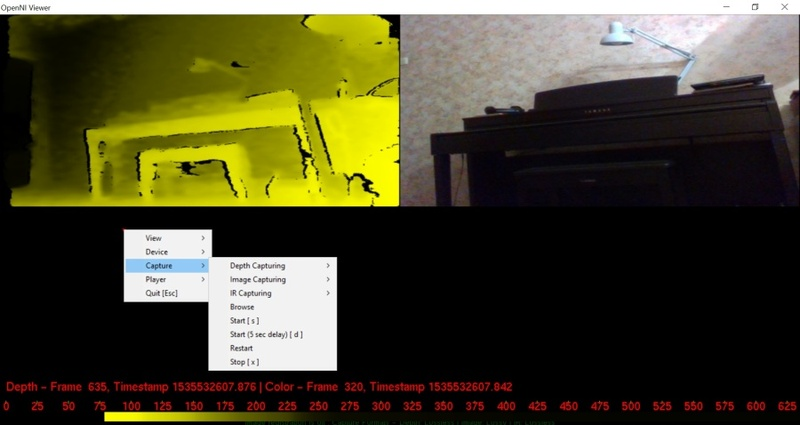

### RealSense2 plugin

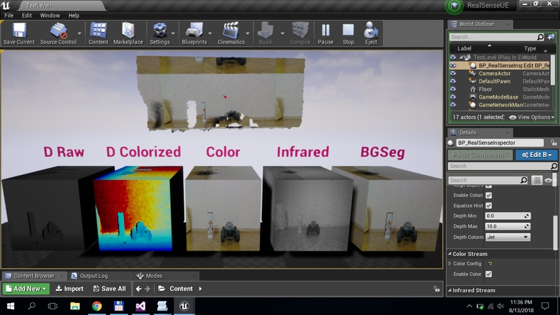

### GStreamer plugin

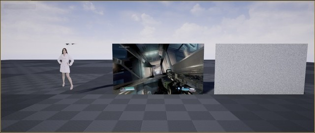

[video](https://www.youtube.com/watch?v=eCLCdaSIxBA)

### Game security research

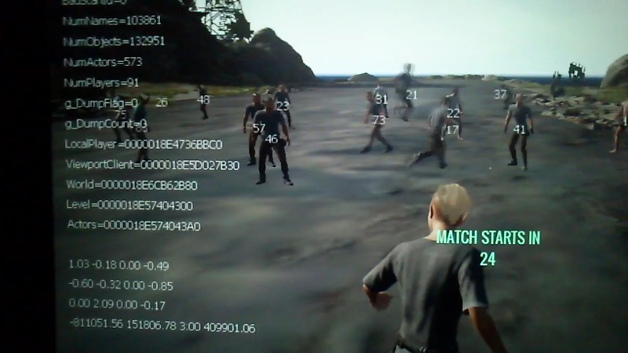

[video](https://www.youtube.com/watch?v=mCRV0-WnZrg)

### Multicamera DVR plugin

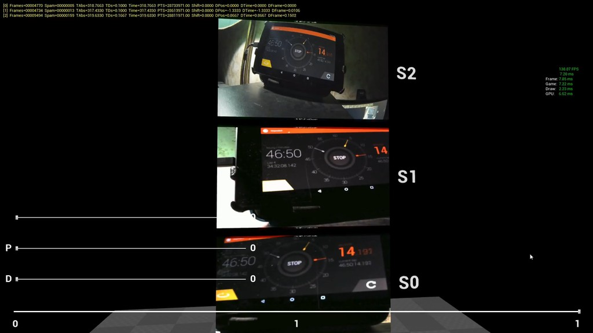

[video](https://youtu.be/WmC1f3ctCck)

### OpenNI plugin

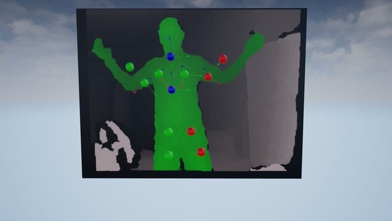

[video](https://youtu.be/RC-qtsRBQ6g)

### Image generator for helicopter pilot training system

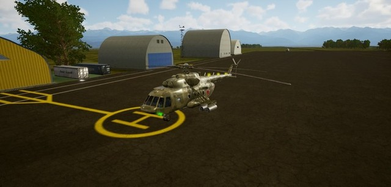

[video](https://www.youtube.com/watch?v=MFQ4Z8JBNjY)

### Punisher remake

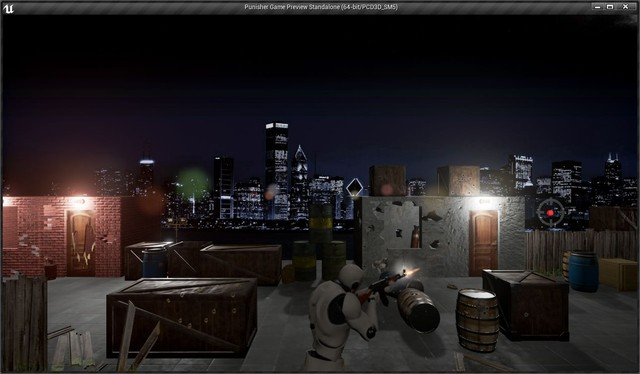

[video](https://youtu.be/bAQ50G9Cz6U)

### Mother Russia Bleeds multiplayer mod

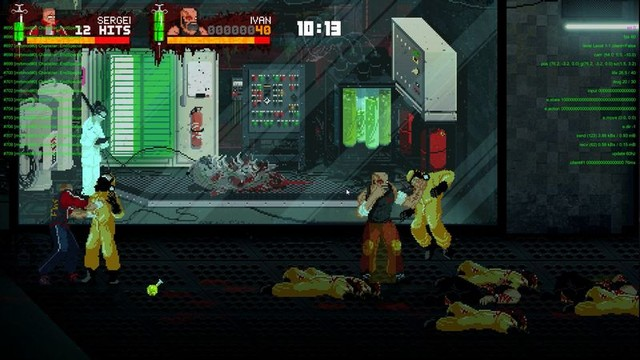

[video](https://youtu.be/FMiY1QO8nvo)

### Augmented reality app for Dota2

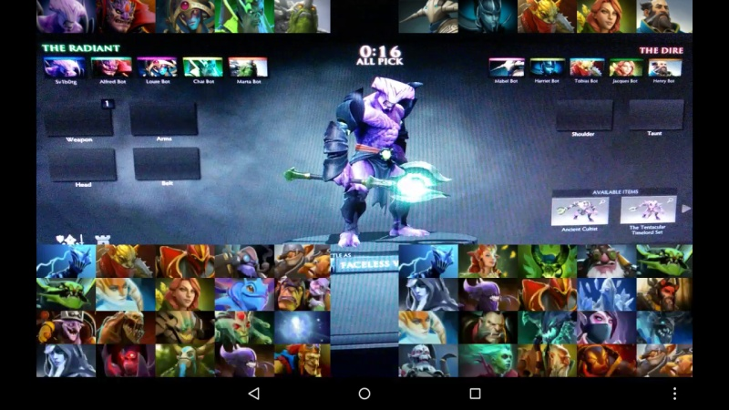

[video](https://www.youtube.com/watch?v=CLN2cCn6FqY)

### Game movie recording tool

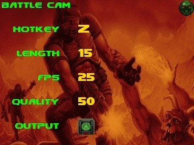

[video](https://www.youtube.com/watch?v=SFS9CT7n8Ps)

### Chrome extension for BFBC2 server monitoring

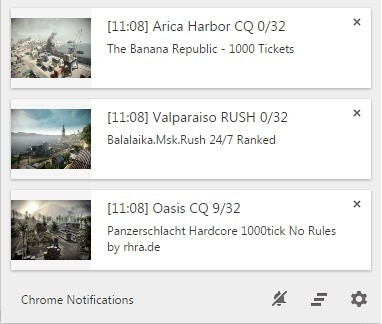

### Robot platform firmware

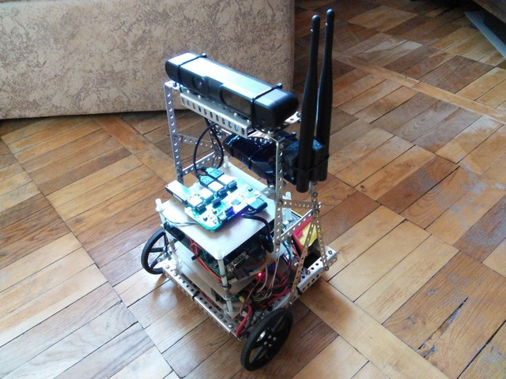

[video](https://www.youtube.com/watch?v=fAfRT1DMnEk)

### Quadrotor telemetry system

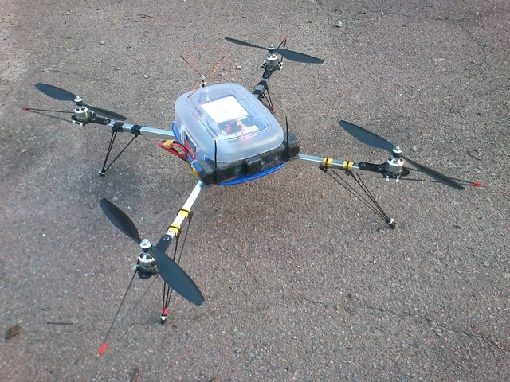

### 2D rendering library for RaspberryPi

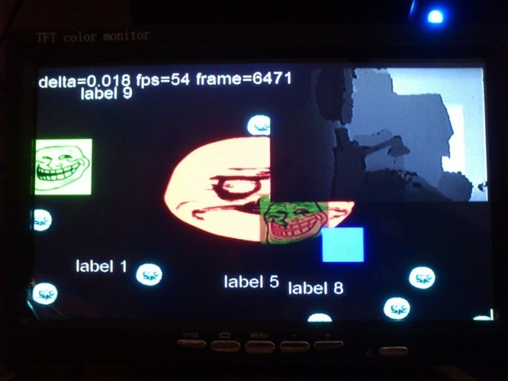

### Squad AI for Codetroopers contest

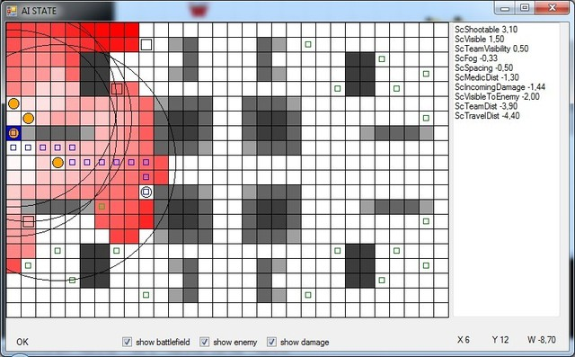

### Bot for Stronghold Kingdoms MMORTS

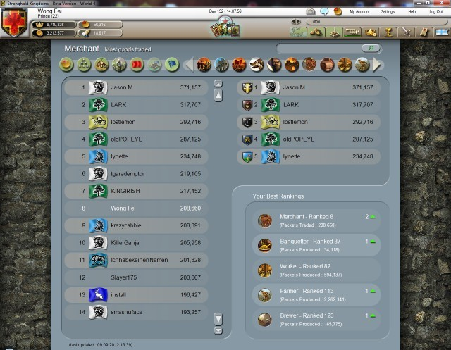

### Ragdoll controlled by motion sensor

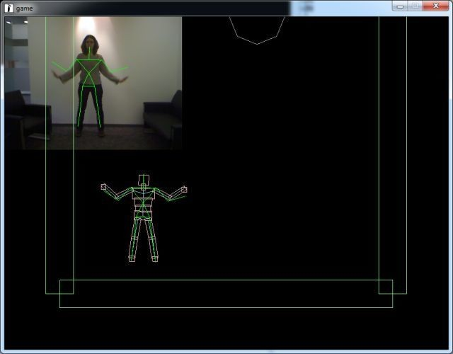

### Naval simulation

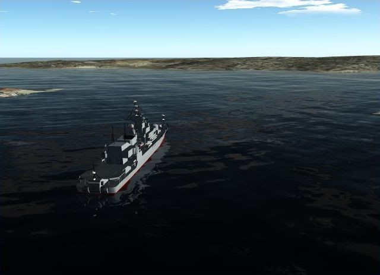

### Pacman clone for XPN 2011 contest

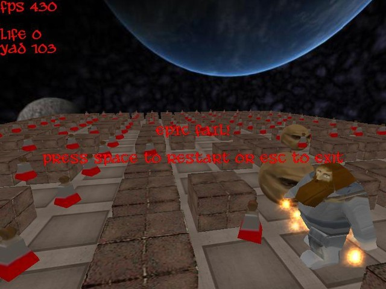

[video](https://www.youtube.com/watch?v=tcP1Ofe73r4)

### Crimsonland clone with multiplayer

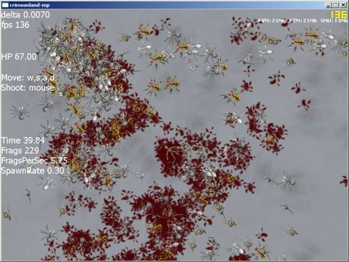

[video](https://www.youtube.com/watch?v=VSnM0xXw5oA)

### Hidden objects puzzle game

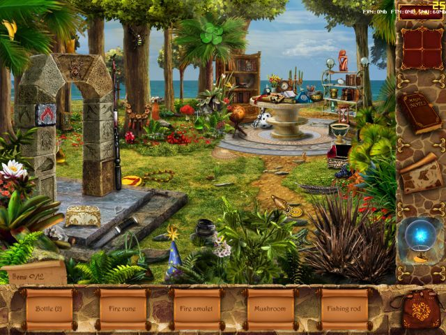

### Position based dynamics simulation

[video](https://www.youtube.com/watch?v=0ndrp_TOmK4)

### Minesweeper online :D

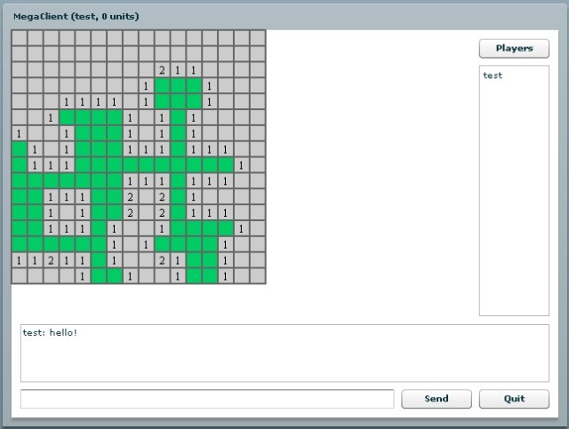
