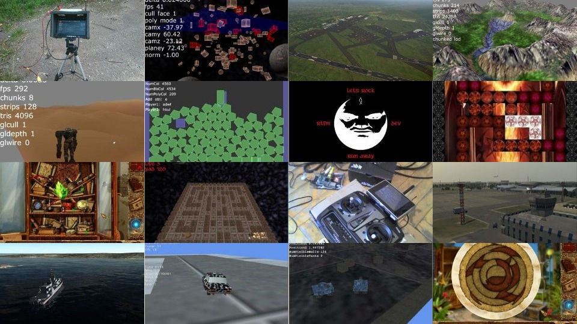

## Exp

C, C++, Windows+kernel, Linux+embedded, backend, UE4

### 2013+ freelancer

* Wireless Android sensor data sender/receiver (C++, UE4, Java, Android)
* Arduino device communication plugin (C++, UE4)
* RPLidar A1 plugin for virtual touch screen project (C++, UE4)
* Yost 3-Space sensor plugin (C++, UE4)
* Blackmagic DeckLink capture card plugin (C++, UE4)
* Assetto Corsa C++ SDK, custom physics mod (C++, IDA)
* PowerFC ECU digital dashboard (C++, Qt, eLinux, RaspberryPi)
* Rotary engine compression tool (C, C#, STM32)
* RealSense2 driver for OpenNI2 (C++)
* RealSense2 plugin (C++, UE4)
* GStreamer render to texture plugin (C++, UE4)
* Game security research (C, C++, IDA, WDM, DKOM, DX11, UE4)
* Multicamera DVR plugin (C++, UE4, Leadtools Multimedia SDK)
* Mother Russia Bleeds multiplayer mod (C#, Unity)
* OpenNI2 plugin (C++, UE4)
* Image generator for helicopter training system (C++, UE4, RakNet)
* Augmented reality app for Dota2 (C++, Android, NDK, OpenCV)
* Game movie recording tool (C++, C#, WinAPI, DX11)
* Robot platform firmware (C, C++, STM32, JetsonTK1, eLinux, Android, OpenNI, RakNet, GStreamer)
* Quadrotor telemetry system (C, C++, RaspberryPi, eLinux, OpenNI, ArduPilot, MavLink)
* 2D rendering library for RaspberryPi (C++, eLinux, GLES2)
* Mobile banking (C#, ASP.NET WebAPI, Windows Phone 8)
* Find people by interests service (C#, Mono, LAMP)
* Bot for Stronghold Kingdoms MMORTS (C#, Mono, ASP.NET)

### 2008-2013 fulltime

* Support Windows kernel display driver (C, C++, WDM, WDDM)
* Profile and optimize OpenNI SDK (C, C++, eLinux, PandaBoard)
* Implement OpenNI browser plugin (C++, boost, NPAPI, Firebreath)
* Implement surround sound subsystem for flight simulator (C++, C#, FMOD)
* Tune VegaPrime middleware for flight simulator project (C++, OpenGL)
* Design and implement Modbus TCP/RTU module (C++, WinAPI, WinSock, MFC)
* Implement data analysis and report generation module (C++, WinAPI, MFC, ODBC)
* Develop hidden objects puzzle game (Lua, Playground SDK)
* Develop control system of industrial process (C, Codesys, Wago, PLC)
* Port corporate web portal (C#, ASP.NET2, MSSQL)

## Showroom

### PowerFC ECU digital dashboard [2018]

C++, Qt, eLinux, RaspberryPi, [video](https://www.youtube.com/watch?v=ydlUFpkKHHQ)

### Rotary engine compression tester [2018]

C, C#, STM32

### RealSense2 driver for OpenNI2 [2018]

C++

### RealSense2 plugin [2018]

C++, UE4

### GStreamer plugin [2018]

C++, UE4, [video](https://www.youtube.com/watch?v=eCLCdaSIxBA)

### Game security research [2017]

C, C++, IDA, WDM, DKOM, DX11, UE4, [video](https://www.youtube.com/watch?v=mCRV0-WnZrg)

### Multicamera DVR plugin [2017]

C++, UE4, Leadtools Multimedia SDK, [video](https://youtu.be/WmC1f3ctCck)

### Mother Russia Bleeds multiplayer mod [2016]

C#, Unity, [video](https://youtu.be/FMiY1QO8nvo)

### OpenNI2 plugin [2016]

C++, UE4, [video](https://youtu.be/RC-qtsRBQ6g)

### Punisher remake [2016]

Blueprints, UE4, [video](https://youtu.be/bAQ50G9Cz6U)

### Image generator for helicopter training system [2016]

C++, UE4, RakNet, [video](https://www.youtube.com/watch?v=MFQ4Z8JBNjY)

### Augmented reality app for DOTA2 [2015]

C++, Android, NDK, OpenCV, [video](https://www.youtube.com/watch?v=CLN2cCn6FqY)

### Game movie recording tool [2015]

C++, C#, WinAPI, DX11, [video](https://www.youtube.com/watch?v=SFS9CT7n8Ps)

### Chrome extension for BFBC2 server monitoring [2015]

JavaScript

### Robot platform [2014]

C, C++, STM32, JetsonTK1, eLinux, Android, OpenNI, RakNet, GStreamer, [video](https://www.youtube.com/watch?v=fAfRT1DMnEk)

### Quadrotor telemetry system [2013]

C, C++, RaspberryPi, eLinux, OpenNI, ArduPilot, MavLink

### 2D rendering library for RaspberryPi [2013]
 
C++, eLinux, GLES2

### Squad AI for Codetroopers contest [2013]
 
C++, C#

### Bot for Stronghold Kingdoms MMORTS [2012]

C#, Mono, ASP.NET, LAMP

### Ragdoll controlled by motion sensor [2012]

C++, Box2D, OpenNI

### Ship simulation system [2011]

C++, C#, VegaPrime

### Pacman clone for XPN contest [2011]
 
C++, Irrlicht, [video](https://www.youtube.com/watch?v=tcP1Ofe73r4)

### Crimsonland clone with multiplayer [2011]

C++, Lua, HGE, [video](https://www.youtube.com/watch?v=VSnM0xXw5oA)

### Hidden objects puzzle game [2009]
 
C++, Lua, Playground SDK

### Position based dynamics simulation [200x]

C++, OpenGL, [video](https://www.youtube.com/watch?v=0ndrp_TOmK4)

### Minesweeper online [200x]

C++, ActionScript3, Flex

### Misc

